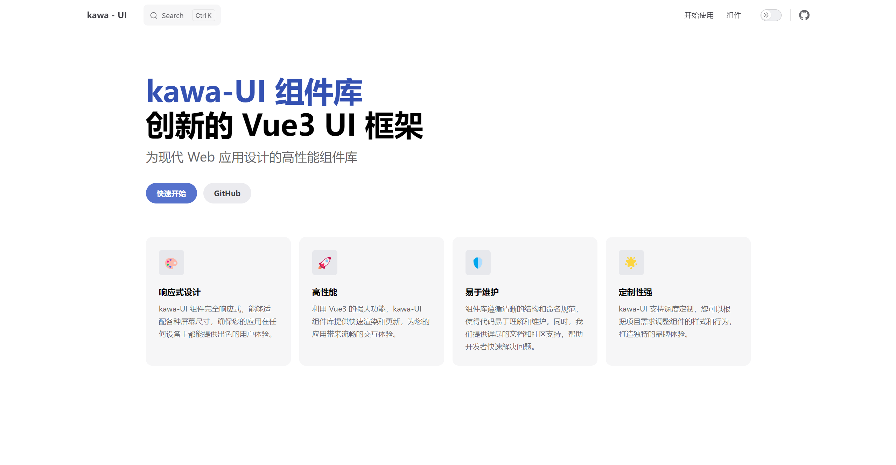
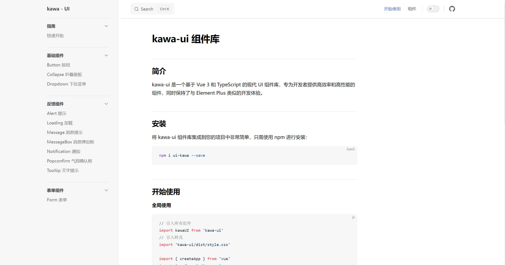
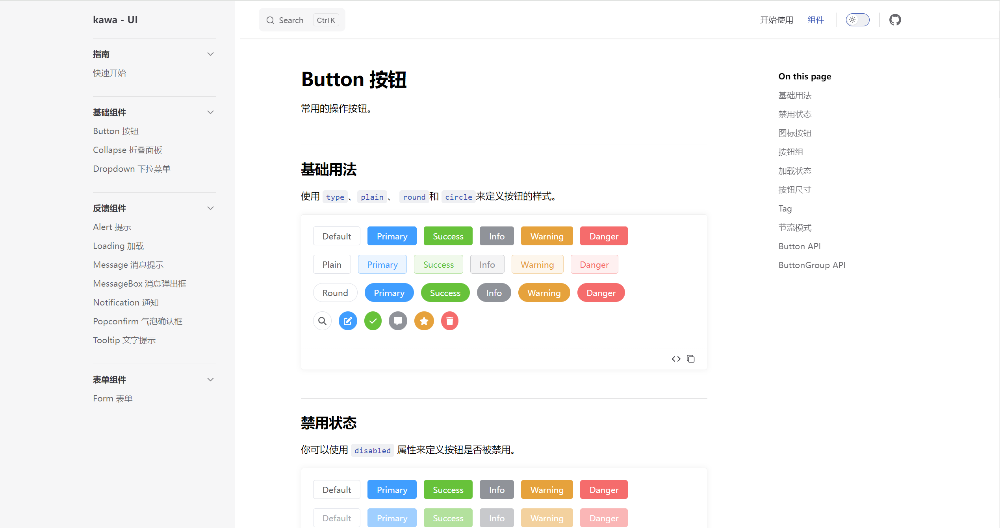
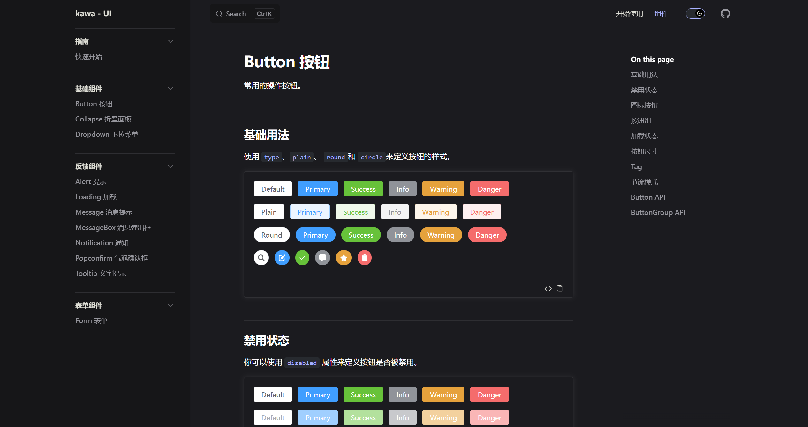
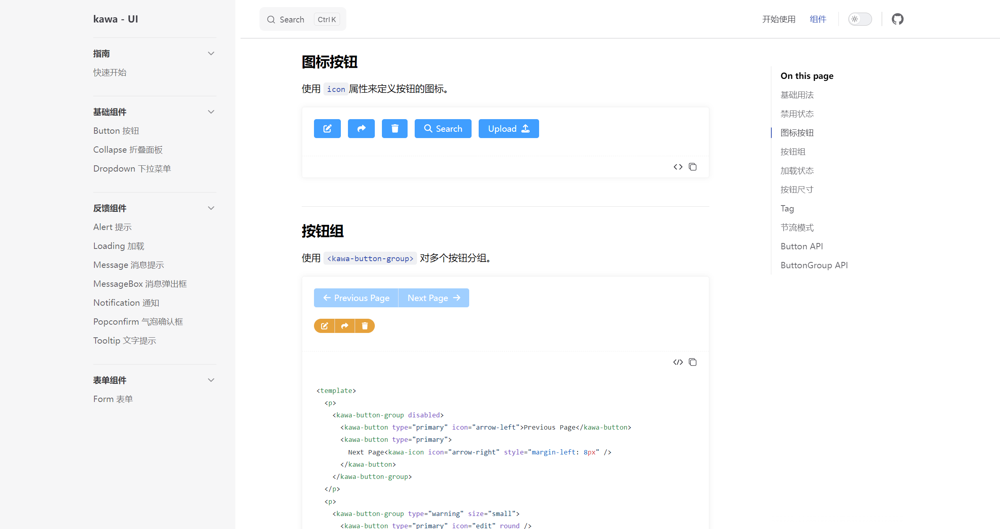

基于 Vue3 + TypeScript + Vite 的 UI 组件库

For my studying  :D


## 特点
- 🌟 完全基于 Vue3 和 TypeScript，享受最新的前端技术红利
- 🚀 极速开发体验，Vite 作为开发服务器，提供闪电般的热更新
- 🎨 丰富的组件库，覆盖各种常见 UI 场景

## 安装

```bash
npm install ui-kawa 
```
## 快速开始

[kawa-ui 项目在线文档地址](https://kawaii993.github.io/kawa-ui/)

首页预览：



快速开始页面：



明暗主题展示：



组件代码预览功能：
